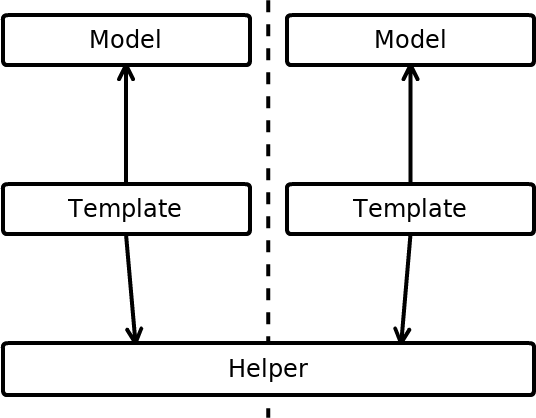
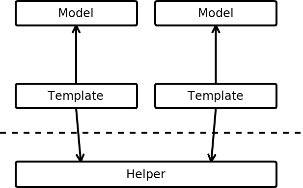
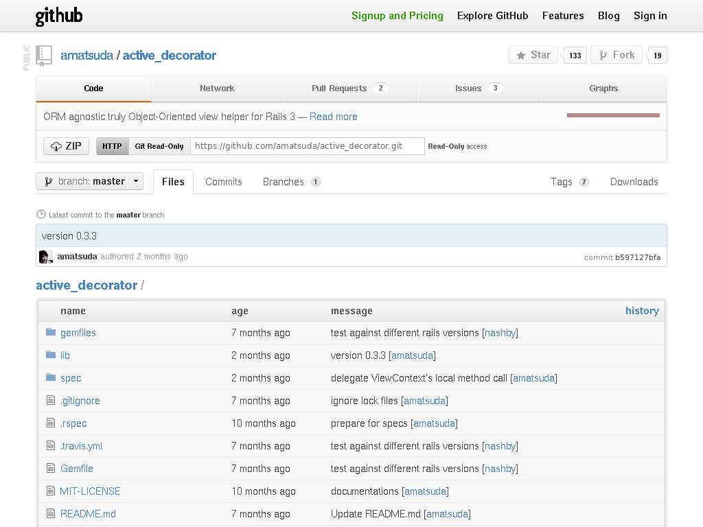
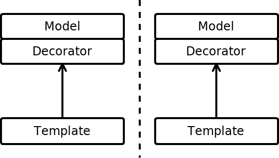
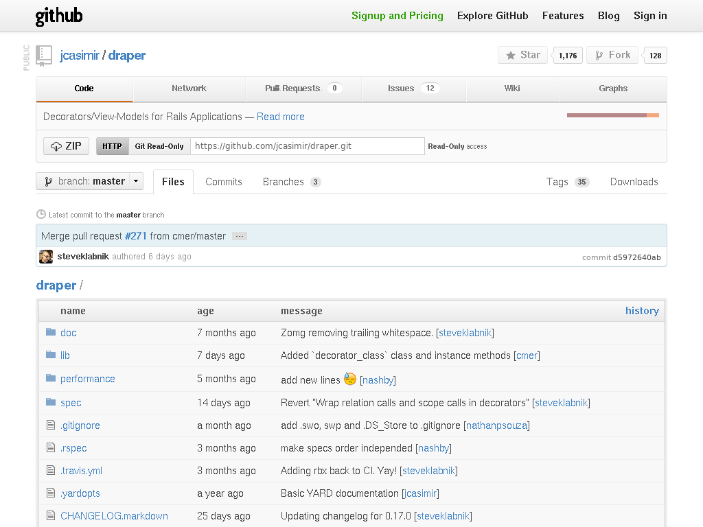
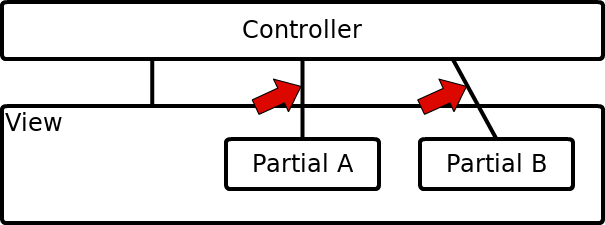
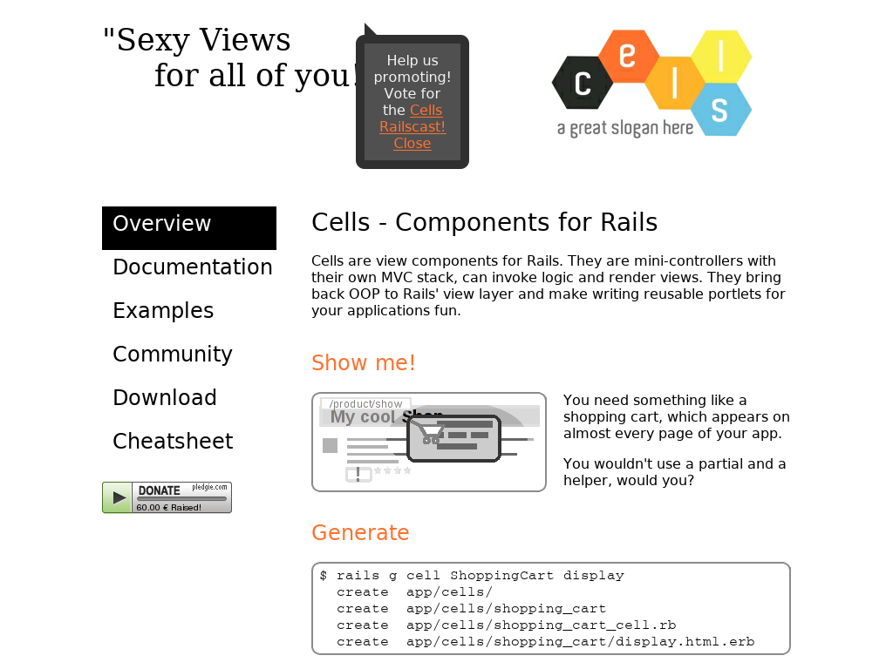
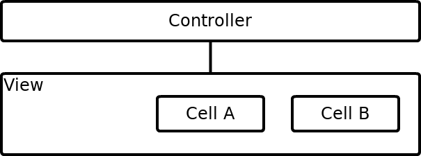
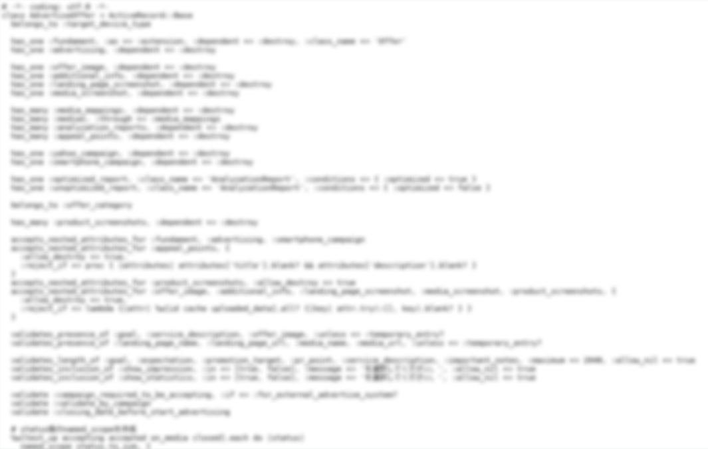
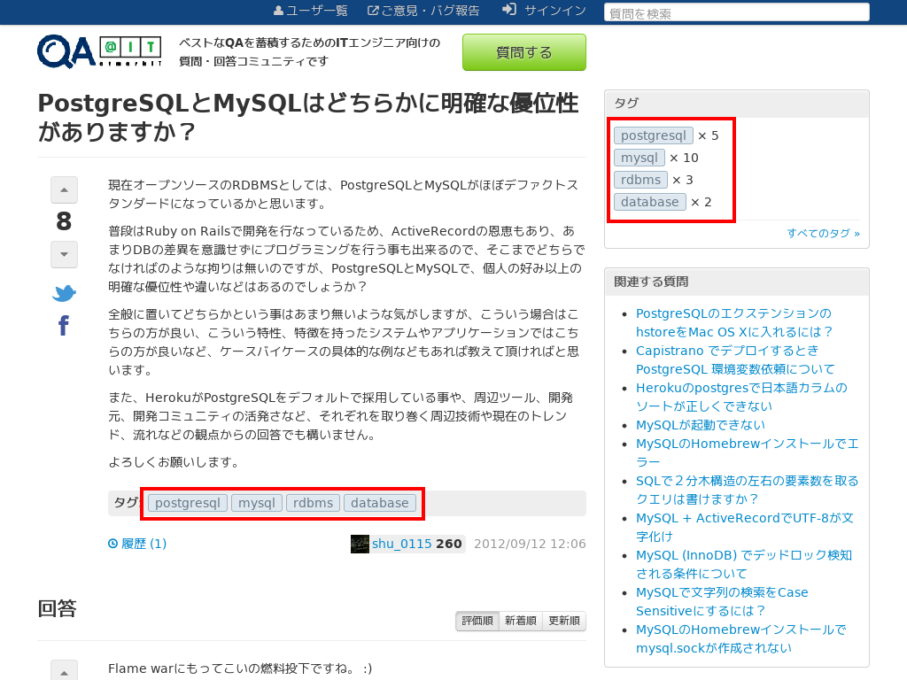

!SLIDE
# Ruby on Rails:
# The Bad Parts

## Keita Urashima

Sapporo RubyKaigi 2012

!SLIDE

# Keita Urashima
#  @ursm

## Chief Programmer and Chief Mechanic at Eiwa System Management, Inc.

!SLIDE full-img

!SLIDE full-img

!SLIDE full-img

!SLIDE

# Rails is Awesome Framework

* Pluggable Architecture
* ActiveRecord Query Interface
* Asset Pipeline
* etc...

!SLIDE

# But, where will this rail is heading?

!SLIDE

# Ideal:
# Clean code, that works

!SLIDE full-img

## Actual:

http://www.flickr.com/photos/essgee/2477102230/in/photostream/

!SLIDE

# Test is necessary, but that is not enough.

!SLIDE

# もしかして: Railsは駄目な子なのでは?

!SLIDE

# I tried other frameworks and libraries such as Sinatra, Padrino, express (node.js), etc.

!SLIDE

# Conclusion:
# Rails is really awesome!

!SLIDE

# What should I do?

!SLIDE full-img

## QA@IT

!SLIDE

# I don't want to keep making the same mistake anymore.

!SLIDE bullets

# Common Pitfalls

* Too many helpers
* Too many partials
* Too fat model

!SLIDE

# I would like to share with you how we coped with these problems.

!SLIDE subsection

# Heleprs don't help our view

!SLIDE small

    @@@ruby
    module ApplicationHelper
      def rendered_question_body(question)
        ...
      end
      def link_to_user(user)
        ...
      end
      # lot of methods...
    end

!SLIDE center

!SLIDE center

!SLIDE

# Our Approach:
# Use ActiveDecorator

!SLIDE full-img

## amatsuda/active_decorator

!SLIDE smbullets

> Automatically mixes decorator module into corresponding model

!SLIDE

    @@@ruby
    # app/models/user.rb
    class User < ActiveRecord::Base
      # first_name:string
      # last_name:string
      # website:string
    end

!SLIDE small

    @@@ruby
    # app/decorators/user_decorator.rb
    module UserDecorator
      def full_name
        "#{first_name} #{last_name}"
      end
    
      def link
        link_to full_name, website
      end
    end

!SLIDE small

    @@@ruby
    # app/controllers/users_controller.rb
    class UsersController < ...
      def index
        @users = User.all
      end
    end

!SLIDE small

    @@@haml
    # app/views/users/index.html.erb
    %ul
      - @users.each do |user|
        %li= user.link

!SLIDE center

# Other Option

* Draper

!SLIDE full-img

## jcasimir/draper

!SLIDE

    @@@ruby
    # app/models/user.rb
    class User < ActiveRecord::Base
      # first_name:string
      # last_name:string
      # website:string
    end

!SLIDE small

    @@@ruby
    # app/decorators/user_decorator.rb
    class UserDecorator < Draper::Base
      decorates :user
      
      def full_name
        "#{user.first_name} #{user.last_name}"
      end
    
      def link
        h.link_to full_name, user.website
      end
    end

!SLIDE small

    @@@ruby
    # app/controllers/users_controller.rb
    class UsersController < ...
      def index
        @users =
          UserDecorator.decorate(User.all)
      end
    end

!SLIDE small

    @@@haml
    # app/views/users/index.html.erb
    %ul
      - @users.each do |user|
        %li= user.link
    
!SLIDE

# Close Enough, But...

## ActiveDecorator

    @@@ruby
    model.object_id ==
      decorated.object_id

## Draper

    @@@ruby
    model.object_id !=
      decorated.object_id

Draper can decorate associated objects automatically.

!SLIDE subsection

# Partial is just partial, not parts

!SLIDE full-img

!SLIDE

# Naturally it's a partial.

!SLIDE small

    @@@haml
    # _recent_tags.html.haml
    %article
      %h2 Recent Tags
      %ul
        - @recent_tags.each do |tag|
          %li= link_to tag.name, tag

!SLIDE

# This variable came from where?

    @@@ haml
    - @recent_tags.each do |tag|
      %li= link_to tag.name, tag

!SLIDE

    @@@ruby
    class QuestionsController < ...
      def index
        # for main view
        @questions = ...
        
        # for partial
        @recent_tags = ...
      end
    end
    
!SLIDE small

    @@@ruby
    class QuestionsController < ...
      before_filter :find_recent_tags
      
      def index
        @questions = ...
      end
      
      private
      
      def find_recent_tags
        @recent_tags = ...
      end
    end

!SLIDE center

!SLIDE

# Our Approach:
# Use Cells

!SLIDE full-img

## apotonick/cells

!SLIDE

> Cells are view components for Rails. They are mini-controllers with their own MVC stack, can invoke logic and render views.

!SLIDE

    app/cells/
      sidebar_cell.rb
      sidebar/recent_tags.html.haml

!SLIDE small

    @@@ruby
    # app/cells/sidebar_cell.rb
    
    class SidebarCell < Cells::Rails
      def recent_tags
        @tags =
          Tag.availables.
            recent(1.month.ago).
            limit(10)

        render unless @tags.none?
      end
    end
    
!SLIDE smaller

    @@@haml
    # app/cells/sidebar/recent_tags.html.haml
    
    %article
      %h2 Recent Tags
      %ul
        - @tags.each do |tag|
          %li= link_to tag.name, tag

!SLIDE small

    @@@haml
    # some view
    
    %aside.sidebar
      = render_cell :sidebar, :recent_tags

!SLIDE

# Passing Arguments

    @@@haml
    = render_cell :answers, :index, @question

!SLIDE smaller

    @@@ ruby
    class AnswersCell < Cells::Rails
      def index(question)
        @answers = ordered_answers(question)
        render
      end
      def ordered_answers(question)
        answers = question.answers
        
        case cookies[:answers_order]
        when 'created'
          answers.order('created_at DESC')
        when 'edited'
          ...
        end
      end
    end
    
!SLIDE center

!SLIDE subsection

# Too fat to be a model

!SLIDE center

A certain model, over 500 lines!

!SLIDE

# Some Approaches:

* Make the small library for your application.

!SLIDE

# Example: Taggable

!SLIDE full-img

!SLIDE smaller

    @@@ruby
    module Taggable
      extend ActiveSupport::Concern
      
      included do
        has_many :taggings, dependent: :destroy
        has_many :tags, through: :taggings
        
        scope :tagged_with, ->(tag) { ... }
        
        validates_with Validator
        after_save     Callback
      end
      ...
    end

!SLIDE

    @@@ruby
    class Question < ActiveRecord::Base
      include Taggable
      ...
    end
    
!SLIDE smaller

    @@@ruby
    class Question < ActiveRecord::Base
      # associations
      # ...
      
      # validations
      # ...
      
      # scopes
      # ...
      
      # callbacks
      # ...
      
      # methods
      # ...
    end

!SLIDE

* Separation of Concerns
* Divide and Conquer

!SLIDE
# "Activity" layer
* このアプリケーションのオレオレ用語
* ユーザの行動をクラスにしたもの
  * post question, post answer, etc...

!SLIDE
# Example: Accepting Answer

!SLIDE smaller

    @@@ruby
    class My::AnswerAcceptingsController < ...
      def update
        @answer = Answer.find(params[:answer_id])

        process_activity :accept_answer,
                         answer:     @answer,
                         questioner: current_user
      end
    end

!SLIDE smaller

    @@@ruby
    class AcceptAnswerActivity < AbstractActivity
      attribute :answer
      attribute :questioner

      validates_signin_of :questioner

      validate do
        errors.add :questioner, ...
        errors.add :question, ...
      end
      ...
      
!SLIDE smaller

    @@@ ruby
      ...
      def do_process
        question.accepted_answer = answer
        question.status = :solved
        question.save!

        if answer.author?(questioner)
          create_event :accept_answer, ...
          create_event :answer_accepted, ...
        else
          ...
        end
      end
    end
    
!SLIDE

# 狙い

* 複数のモデルが絡むロジックはどこに置けばいいのか?
* 今まで一緒くたにモデルに突っ込まれていた振舞いが、あるべき場所に収まった気がする

!SLIDE

# →DCI

!SLIDE subsection

# Common Point of "Common Pitfalls"
