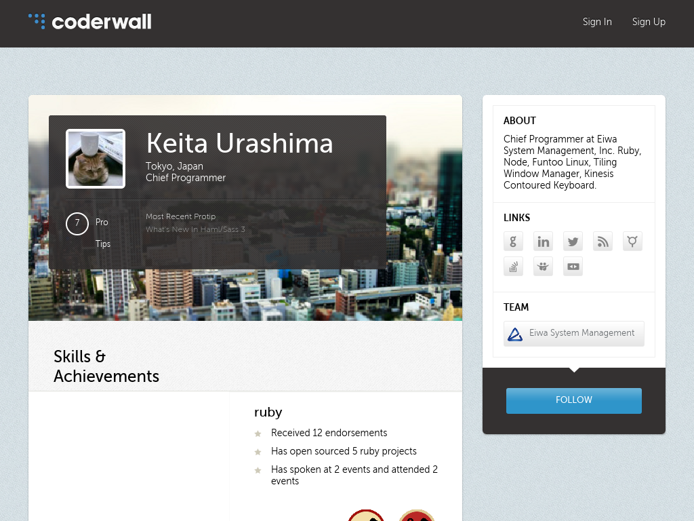

!SLIDE
# Ruby on Rails:
# The Bad Parts

## Keita Urashima

Sapporo RubyKaigi 2012

!SLIDE bullets

# Keita Urashima

* http://coderwall.com/ursm

!SLIDE full-img

!SLIDE

(会社の紹介とIdobataの話とhiringの話)

!SLIDE

# Goal

* 「動作する」「きれいな」コード
* テストを書くことは助けになるが、それだけでは十分ではない
* きれいなコードベースを構築するには戦略が必要

!SLIDE

# Common Pitfalls

* Too many helper methods
* Too many filters and partials
* Huge model

!SLIDE subsection

# Helper Hell

!SLIDE

# Problem

* 大量の helper method が作られて管理不能な状態に陥いっている
* helper には namespace が存在しない
* helper は関数的メソッドの集合で、object oriented ではない

!SLIDE

# Solution

* 例えば helper を避ける
* presentation logic をモデルに注入する
  * ActiveDecorator
  * Draper
* view model を導入する
  * Mustache, Handlebars

!SLIDE

# Caveats

* helper は常に悪というわけではない。バランス大事

!SLIDE subsection

# Where is Component?

!SLIDE

# Problem

* 独立したUIパーツをpartialによって実現しているが、データの準備はコントローラで行っている
* 独立しているはずなのに独立できていない
  * パーツを別の場所に動かそうとしたとき、テンプレートとコントローラの両方を修正しなければならない

!SLIDE

# Solution

* 簡単なものならテンプレートから直接データを取ってしまう
  * 「すべてインスタンス変数を経由しなければならない」という思い込みを捨てる

!SLIDE

* データの準備をfilterにやらせる
  * コントローラの修正はfilterの移動だけで済むが、「users#show でそのユーザに関連する情報を表示する」のような依存関係がある場合、ユーザの取り出しもfilterにしなくてはならなくなる

!SLIDE

# Cells - Components For Rails

!SLIDE subsection

# Fat Model Kills Your Application

!SLIDE

# Problem

* "Thin Controller, Fat Model" を忠実に実行した結果、超巨大なモデルが鎮座している

!SLIDE

# Solution

* 名前を付けて分割せよ
  * ActiveSupport::Concern, modularity
* ドメインに依存しない部分を切り出して mini library を作る
* より適切な置き場所があるのでは?
  * ある特定の状況でのみ必要になる振舞い
  * 複数のモデルが協調して実現する振舞い
    * poorman's DCI
